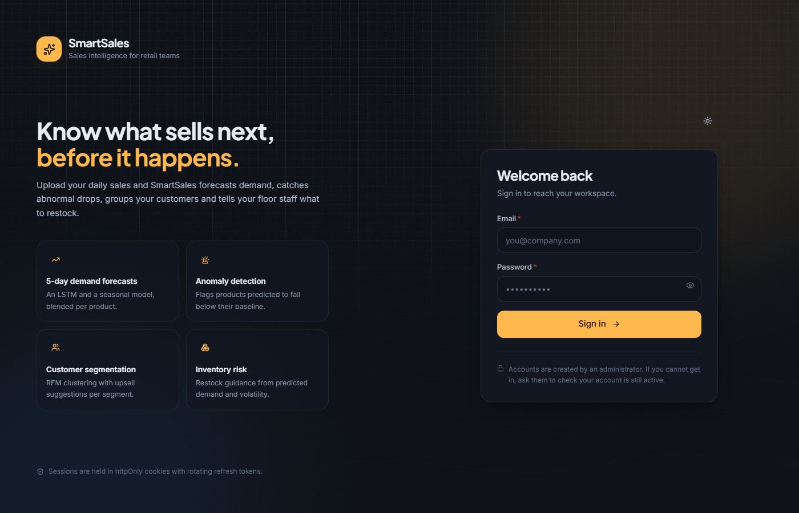
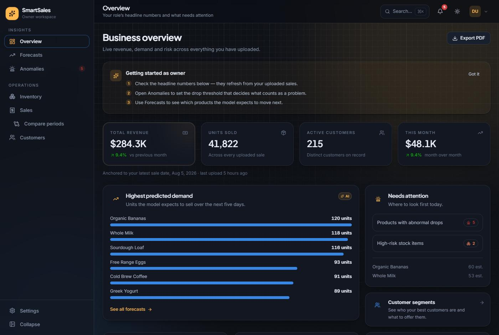
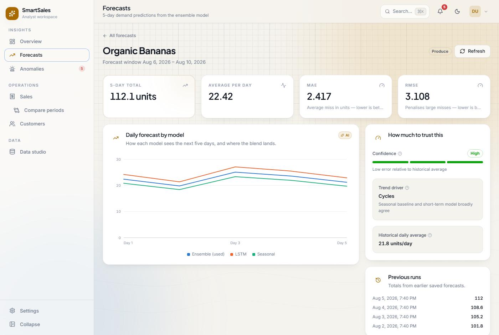
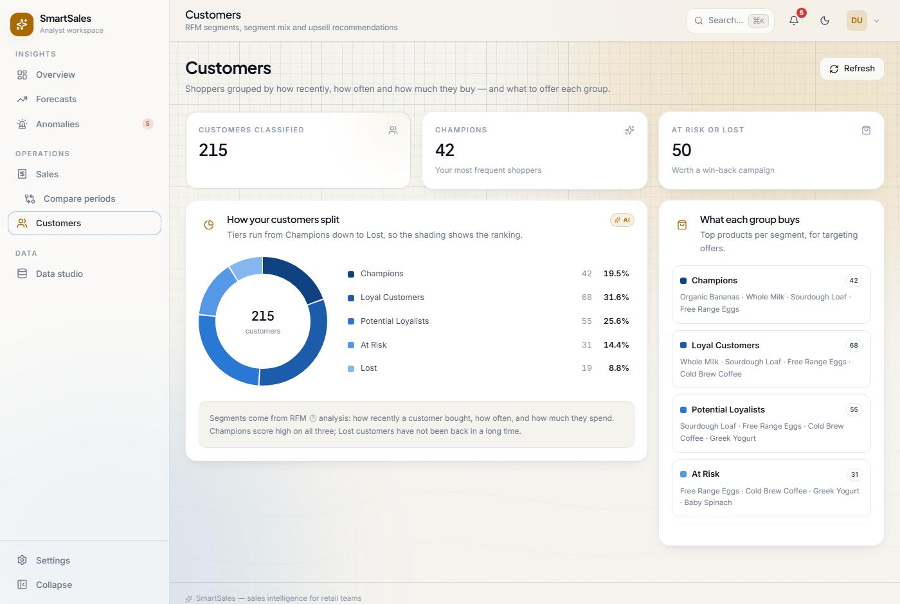
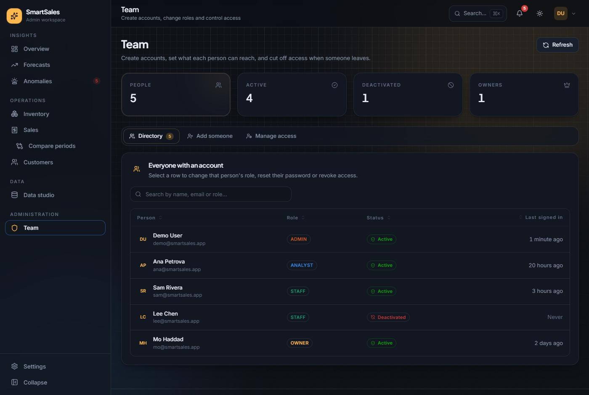

# SmartSales

A sales-intelligence platform for a shop or small chain: a React frontend, an Express API, and a Python/PyTorch model service, backed by Postgres (Supabase). Upload a daily sales CSV and the rest is derived from it — five-day demand forecasts per product, anomaly detection against each product's own baseline, RFM customer segmentation, and restock guidance — surfaced differently to each of four roles, with access enforced server-side.



## Getting started

### Prerequisites
- Node.js 18+
- Python 3.9+
- A Supabase Postgres project

### One-time database step
Run `backend/schema.sql` then `backend/migrations/002_auth_sessions.sql` in the Supabase SQL editor — the auth layer needs the `token_version` column and the `auth_sessions`/`auth_events` tables.

### Install
```bash
git clone https://github.com/Yasir-Zafar/SmartSales.git
cd SmartSales

cd backend && npm install
cd ../frontend && npm install
cd ../ml && pip install -r requirements.txt
```

### Run (three processes)
```bash
# 1 — model service, from ml/
uvicorn app:app --host 0.0.0.0 --port 8000

# 2 — API, from backend/
npm run dev

# 3 — frontend, from frontend/
npm start
```

Create a `.env` in both `backend/` and `ml/` with your own Supabase credentials and JWT signing secrets — see `backend/src/config` and `ml/database.py` for the exact variable names each service reads.

## Tech stack

| Layer    | Technology                          |
|----------|--------------------------------------|
| Frontend | React 19                              |
| Backend  | Express 5 (Node.js)                   |
| ML       | FastAPI + PyTorch (LSTM + seasonal)   |
| Database | Postgres (Supabase)                   |
| Auth     | JWT access + refresh cookies, rotation, CSRF, rate limiting |

## What it does

- **What will sell** — an LSTM and a seasonal model each forecast five days out per product; the app shows their blended ensemble.
- **What's about to go wrong** — each forecast is compared against its own historical baseline; a big enough drop is flagged, with severity scaled off an owner-set threshold. A second guard watches total forecast revenue.
- **Who's buying, and what next** — customers are clustered on recency, frequency and spend into five ordered tiers (Champions → Loyal → Potential Loyalists → At Risk → Lost), each with a recommended action and the products that tier actually buys.
- **What to restock** — predicted demand plus sales volatility becomes a shortage risk, shown to staff as a plain sentence rather than a number to interpret.

**Pipeline:** staff upload a CSV → rows land in `daily_sales` → an analyst picks a date window and reloads the model with it → each reload snapshots every product's forecast into Postgres → every screen reads from there. Nothing in the interface invents a number; each one traces back to an uploaded row or a saved model run.

<p align="center">
  
  
</p>

## Roles & permissions

Access is enforced on the server, per endpoint — the sidebar, command palette and route guards all read one shared role definition, so the UI never shows a control it would be refused for. Admin isn't a superset by accident: every insight route lists `ADMIN` alongside its owning role, so an administrator can reproduce what a user sees without borrowing their account.

<p align="center">
  
  
</p>

### Owner
The person who cares about the money. Reads everything about performance; changes nothing about data.
Live revenue/units/customers with month-over-month change · all forecasts · anomaly alerts (sets the threshold) · revenue guard floor · customer segments and their recommended actions · stock levels · sales explorer and period comparison · PDF export.

### Analyst
The person who cares whether the model is any good, and who owns retraining it.
Per-product forecast deep dive across all three model series · accuracy (MAE/RMSE/MAPE) and forecast-vs-actual · confidence rating and trend driver · history of saved forecast runs · segment profiles and top products per segment · anomaly history · sales explorer, CSV export, period comparison · exports a training window and reloads the model with it.

### Staff
The person on the floor. Puts data in, gets told what to do with it.
Uploads the daily sales CSV (the only role that can) · today's/this week's takings and top items · stock levels with five urgency bands · restock guidance ranked by shortage risk · customer lookup (segment + what to offer) · upload history.

### Admin
The person who controls who gets in. Also holds every other role's read access, for support.
Creates owner/analyst/staff accounts · changes roles (incl. promoting to admin) · resets passwords (signs that person out everywhere) · deactivates accounts (ends sessions immediately) · sees full upload history and ingestion health · reaches every insight page the other three roles have.

<details>
<summary><strong>Full permission matrix</strong> — every endpoint mapped to the roles that can call it</summary>

A `·` means the server returns `403 FORBIDDEN_ROLE` — not that a button is merely hidden.

| Capability | Endpoint | Owner | Analyst | Staff | Admin |
|---|---|:-:|:-:|:-:|:-:|
| Sign in / refresh / sign out | `/api/auth/*` | ✓ | ✓ | ✓ | ✓ |
| Own sessions — list, end | `GET·DELETE /api/auth/sessions` | ✓ | ✓ | ✓ | ✓ |
| Change own password | `POST /api/auth/change-password` | ✓ | ✓ | ✓ | ✓ |
| Live business KPIs | `GET /api/insights/owner/kpis/live` | ✓ | · | · | ✓ |
| Latest saved forecast batch | `GET /api/insights/owner/forecasts/latest` | ✓ | · | · | ✓ |
| All forecasts (owner view) | `GET /api/insights/owner/forecasts` | ✓ | · | · | ✓ |
| All forecasts (analyst view) | `GET /api/insights/analyst/forecasts` | · | ✓ | · | ✓ |
| Product forecast deep dive | `GET /api/insights/analyst/forecast/:product` | · | ✓ | · | ✓ |
| Forecast vs. actual | `GET /api/insights/analyst/forecast-vs-actual/:product` | · | ✓ | · | ✓ |
| Prior saved runs for a product | `GET /api/insights/analyst/forecast/:product/snapshots` | · | ✓ | · | ✓ |
| Anomaly notifications (live count) | `GET /api/insights/alerts/notifications/abnormal-drops` | ✓ | ✓ | · | ✓ |
| Anomaly detection history | `GET /api/insights/alerts/history/abnormal-drops` | ✓ | ✓ | · | ✓ |
| Drop status for every product | `GET /api/insights/alerts/dropped-status` | ✓ | ✓ | · | ✓ |
| Owner abnormal-drop alerts | `GET /api/insights/owner/alerts/abnormal-drops` | ✓ | · | · | ✓ |
| Analyst abnormal-drop alerts | `GET /api/insights/analyst/abnormal-drops` | · | ✓ | · | ✓ |
| Read/set/reset drop threshold | `GET·PUT·DELETE …/abnormal-drops/thresholds` | ✓ | · | · | ✓ |
| Revenue guard status | `GET /api/insights/owner/alerts/revenue-threshold` | ✓ | · | · | ✓ |
| Read/set/reset revenue floor | `GET·PUT·DELETE …/revenue-threshold/threshold` | ✓ | · | · | ✓ |
| Customer segment membership | `GET /api/insights/owner/customer-segments` | ✓ | · | · | ✓ |
| Segment profiles + top products | `GET /api/insights/analyst/segments` | · | ✓ | · | ✓ |
| Customer upsell lookup | `GET /api/insights/staff/customers/:id/upsell` | · | · | ✓ | ✓ |
| Inventory risk / restock guidance | `GET /api/insights/staff/inventory/risk` | ✓ | · | ✓ | ✓ |
| Product catalog + stock levels | `GET /api/products` | ✓ | · | ✓ | ✓ |
| Daily/weekly sales summary | `GET /api/insights/staff/sales-summary` | · | · | ✓ | ✓ |
| Query sales records | `GET /api/csv/records` | ✓ | ✓ | · | ✓ |
| List sale categories | `GET /api/csv/categories` | ✓ | ✓ | ✓ | ✓ |
| Upload a sales CSV | `POST /api/csv` | · | · | ✓ | ✓ |
| Read upload history | `GET /api/csv` | · | ✓ | ✓ | ✓ |
| Export a training window as CSV | `GET /api/analyst/training-export` | · | ✓ | · | ✓ |
| Reload the model with new data | `POST /api/analyst/retrain` | · | ✓ | · | ✓ |
| List all users | `GET /api/admin/users/list` | · | · | · | ✓ |
| Create an account | `POST /api/admin/create-user` | · | · | · | ✓ |
| Change a role | `PATCH /api/admin/users/:id/role` | · | · | · | ✓ |
| Reset someone's password | `PATCH /api/admin/users/:id/password` | · | · | · | ✓ |
| Activate / deactivate an account | `PATCH /api/admin/users/:id/status` | · | · | · | ✓ |

</details>

## Screens

One shell hosts every page — grouped sidebar, persistent top bar, `⌘K` command palette listing every action the signed-in role has. AI-backed data (forecasts, anomalies, segments, inventory risk) prefetches in the background the moment you sign in, so opening a tab renders from memory instead of waiting on the model service.

| Route | Roles | What's there |
|---|---|---|
| `/overview` | all | One route, four dashboards — live KPIs and needs-attention (Owner), anomaly/segment counts and top products (Analyst), today's/weekly takings (Staff), ingestion health (Admin) |
| `/forecasts` | Owner, Analyst | Searchable/sortable forecast list; `/forecasts/:product` for the per-product deep dive with all three model series, confidence and forecast-vs-actual |
| `/anomalies` | Owner, Analyst | Active alerts, sensitivity control, all-products status view, detection history, revenue guard |
| `/inventory` | Owner, Staff | Stock levels in five urgency bands; restock guidance ranked by shortage risk |
| `/sales` | all | Records explorer with live totals and CSV export (Owner/Analyst), daily summary (Staff); `/sales/compare` for period-over-period deltas |
| `/customers` | all | Segment breakdown, full customer list (Owner/Analyst), at-the-till customer lookup (Staff) |
| `/data` | Analyst, Staff | CSV upload with inline validation, upload history, model retraining window |
| `/team` | Admin | User directory, account creation, role/password/status management |
| `/settings` | all | Theme, own password change, active-session management |

Every dead end is designed for: skeletons instead of spinners, a named "AI service is offline" state with the exact command to start it, wrong-role pages that explain what you're missing rather than bouncing you out, and destructive actions gated behind a confirmation dialog.

## Contributing

Pull requests are welcome. For major changes, open an issue first to discuss what you'd like to change.
